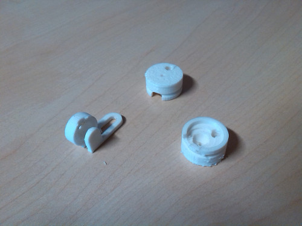
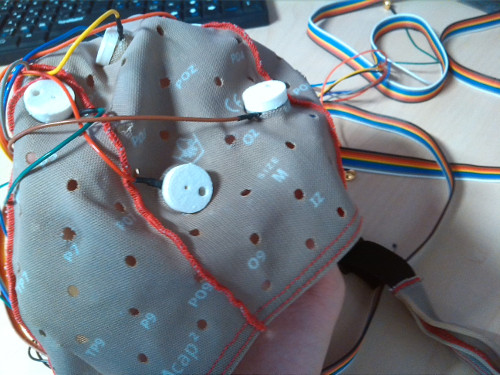
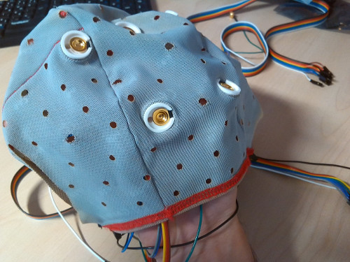

In this repository you'll find various attempts at making OpenBCI gold cup electrodes fit into a medical EEG cap, for instance one from g.tec: [http://www.gtec.at/](http://www.gtec.at/). As with the original g.tec electrodes, a saline gel should be added to make contact with the skin -- that's what the holes are for, aloe vera + table salt may do the trick.

Case/holder: at the moment electrodes are only maintained by the tension from the fabric.

Earclip v1 is tiny but quite a pain to put on. Earclip v2 is based on the "Clip Peg - General purpose" model from Thomas Forsyth: [http://www.thingiverse.com/thing:298955](http://www.thingiverse.com/thing:298955)

3D elements used to create the 3D models are in the "src" folder -- messy blender files (unit: centimetre).

Printing: scale x10 in MakerWare, holders printed upside-down. Tested with MakerBot Replicator 2 -- 15% infill, 2 shells, 0.1mm layer height.

Early work, I'm not responsible for the non-manifoldness and other weirdities that could occur to the 3D models ;)

TODO: clever locking mechanism that do not require permanent glue.

----

Licence: let's say CC-BY-NC
